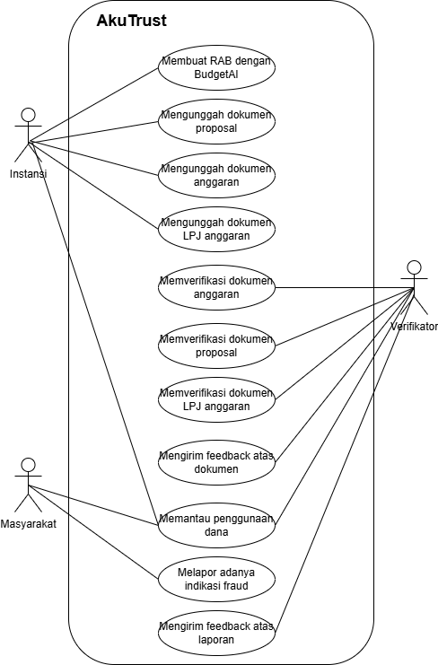
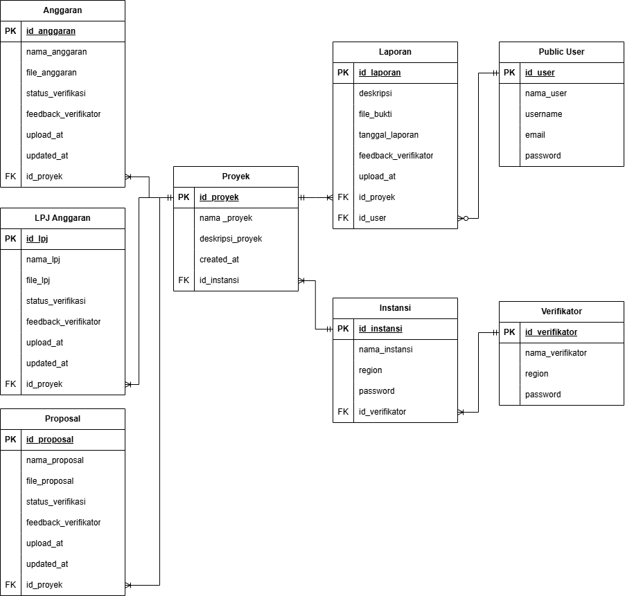

# AkuTrust

## Tentang AkuTrust
AkuTrust adalah platform berbasis AI yang dirancang untuk meningkatkan transparansi dan efisiensi dalam pengelolaan dana penataan dan rehabilitasi bangunan daerah. Dengan AkuTrust, diharapkan sistem keuangan daerah menjadi lebih bersih, akuntabel, dan terhindar dari korupsi.

---

## Tim Pengembang
**TETIwarriors**
- **Hanifah Putri Ariani** - 22/504042/TK/55111 *(Ketua)*
- **Raffa Alzena Zhafirah** - 22/505656/TK/55353 *(Anggota 1)*
- **Luthfi Hanif** - 22/497890/TK/54589 *(Anggota 2)*

**Senior Project TI**  
Departemen Teknik Elektro dan Teknologi Informasi, Fakultas Teknik, Universitas Gadjah Mada

---

## Latar Belakang
Sejak diterapkannya desentralisasi pemerintahan di Indonesia melalui otonomi daerah, pemerintah daerah memiliki kewenangan penuh dalam pengelolaan anggaran. Namun, transparansi dalam penggunaan dana masih menjadi tantangan besar.

Berdasarkan data **Komisi Pemberantasan Korupsi (KPK)**, sejak 2004 hingga 2023 terdapat **1.681 kasus korupsi**, di mana **188 kasus dilakukan oleh pejabat daerah**. Hal ini semakin memperburuk kepercayaan publik terhadap pemerintah daerah.

Menurut laporan **Indonesia Corruption Watch (ICW) tahun 2021**, korupsi di sektor anggaran dana desa mencapai **154 kasus**, dengan total kerugian negara **Rp 233 miliar**. Bentuk-bentuk korupsi yang paling umum meliputi:
- Penyalahgunaan anggaran
- Proyek fiktif
- Mark up anggaran

Dengan angka kerugian negara mencapai **Rp 18 triliun**, seharusnya dana tersebut bisa dimanfaatkan untuk pembangunan dan kesejahteraan masyarakat. Oleh karena itu, AkuTrust hadir untuk meningkatkan transparansi dan efisiensi dalam pengelolaan dana daerah guna mencegah potensi penyalahgunaan anggaran.

---

## Ide Solusi
AkuTrust adalah solusi berbasis **AI** yang dirancang untuk:
✅ Meningkatkan transparansi dalam pengelolaan dana daerah
✅ Meminimalisir risiko penyalahgunaan anggaran
✅ Mengoptimalkan sistem audit keuangan daerah secara otomatis
✅ Memudahkan akses publik terhadap laporan keuangan pemerintah daerah

Dengan AkuTrust, pengawasan anggaran daerah menjadi lebih mudah dan akuntabel, membantu menciptakan tata kelola keuangan daerah yang lebih bersih dan profesional.

---

## Analisis Kompetitor
### 🔹 Kompetitor 1: **Wave** *(Indirect Competitor)*
- **Jenis Produk:** Cloud-based Accounting Software
- **Target Customer:** UMKM & Freelancer
- **Kelebihan:**
  - Gratis untuk fitur dasar
  - User-friendly & cloud-based
  - Terintegrasi dengan pembayaran online
- **Kekurangan:**
  - Tidak mendukung pelaporan dana APBD
  - Tidak memiliki fitur compliance dengan regulasi keuangan daerah
- **Key Competitive Advantage & Unique Value:**
  - 💡 *Powerful accounting software for small businesses, completely free*

### 🔹 Kompetitor 2: **HashMicro** *(Direct Competitor)*
- **Jenis Produk:** ERP & Akuntansi Enterprise
- **Target Customer:** Korporasi, perusahaan besar, & lembaga pemerintah
- **Kelebihan:**
  - ERP lengkap & customizable
  - Automasi tinggi & integrasi dengan modul lain
  - Sudah digunakan oleh banyak perusahaan besar
- **Kekurangan:**
  - Tidak spesifik untuk pelaporan dana APBD
  - Implementasi lebih kompleks & memakan waktu lama
  - Biaya lebih mahal karena berbasis sistem ERP besar
- **Key Competitive Advantage & Unique Value:**
  - 💡 *Comprehensive & fully customizable ERP for businesses & governments*

### 🔹 Kompetitor 3: **QuickBooks** *(Indirect Competitor)*
- **Jenis Produk:** Accounting & Finance Management Software
- **Target Customer:** UMKM, startup, & perusahaan menengah
- **Kelebihan:**
  - Brand global & dipercaya banyak bisnis
  - Integrasi luas dengan aplikasi pihak ketiga
  - Memiliki fitur AI-based insight untuk analisis keuangan otomatis
- **Kekurangan:**
  - Fokus ke bisnis, bukan pemerintahan
  - Tidak dirancang untuk kepatuhan regulasi keuangan daerah
  - Model harga berlangganan lebih mahal dalam jangka panjang
- **Key Competitive Advantage & Unique Value:**
  - 💡 *Smart accounting software to help you grow your business effortlessly*

---

## Mengapa AkuTrust?
🎯 **Spesifik untuk pemerintahan daerah** – Dirancang untuk kepatuhan regulasi keuangan daerah
💡 **Berbasis AI** – Automasi analisis keuangan untuk mencegah penyalahgunaan dana
📊 **Meningkatkan transparansi** – Mempermudah akses publik terhadap laporan anggaran

Dengan AkuTrust, kita bersama-sama membangun pemerintahan yang lebih bersih, transparan, dan akuntabel untuk Indonesia Emas 2045! 🚀

---

## Use Case Diagram  
Berikut adalah diagram use case AkuTrust yang menggambarkan bagaimana sistem bekerja dan pihak-pihak yang terlibat:  

  

---

## Entity Relationship Diagram (ERD)  
Diagram ERD berikut menunjukkan bagaimana data dalam AkuTrust diorganisasikan:  

  

